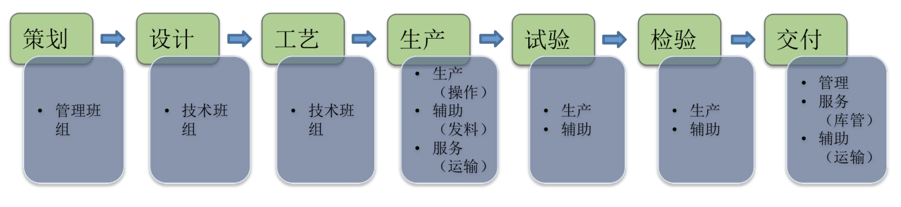

<h1 align="center">质量信得过班组学习材料</h1>

## 目录

[TOC]

## 科学分析方法

```
参考QC的新旧七大工具
是由日本总结出来的，是统计管理方法，又称初级统计管理方法或者新旧QC七大工具（方法）
旧QC工具偏重于统计分析，针对问题发生后的改善
新QC工具偏重于思考分析过程，主要是强调在问题发生前进行预防
```

### 旧QC七大工具

#### 检查表

为了获取数据并加以整理，必须采用某种手法，以方便的记录有关数据，并且以便于整理的方式把这些数据集中起来。

检查表就是适应这种需要而设计出来的一种表格，通过检查表，只需要进行建大的检查（确认），就能收集到各种信息。

检查表的使用有两种用途，即记录用检查表和点检用检查表

#### 层别法

是指“根据一定的标准，把整体分为几个部分”。在QC的场合下，通常将根据所具有的共同特点（如不良的现象或原因等）把全部数据分成几组的做法

#### 柏拉图

```
也叫帕累托图、排列图
帕累托因对意大利20%的人口拥有80%的财产的观察而著名，后来被别人概括为帕累托法则（20/80法则）
```

帕拉图法则的含义是“在多数的不良现象或原因之中，真正重要的只有少数若干项”

对应问题按不良项目或原因别，就起损失金额、不良数量、发生件数等由大至小顺序累成柱状图并做累计曲线

#### 因果图

<span id="yinguotu">鱼骨图</span>

```
又名特性要因图、鱼骨图或石川图
```

是将问题（特性）和可能发生原因（要因）之间的关系以肩头连接，并将要因细分整理而成的因果关系图。一般而言，产生某问题的原因很多，要将这些要因有系统地掌握，运用因果图是有效的

#### 散布图

是对成对的两种数据之间关系状况的调查图。所谓成对的两种数据，指的是从其中的一种数据可以得出性质不同的第二种数据这一情形

#### 直方图

表述测量数据（尺寸、重量、时间等计量值）具有怎样的偏差（分布），且容易把握整体情况。也叫柱状图

#### 控制图

是根据特性值的变动判断工序是否发生异常的一种曲线图。区分偶因和异因引起质量波动，监控过程的稳定。

------

每个工具都有鲜明的特点，他的存在完全可以与问题解决流程不同环节相匹配，比如：

- 检查表、层别法、柏拉图重点应用在选定主题、调查现状阶段
- 因果图和散布图重点应用在原因分析阶段中
- 直方图和控制图重点应用在效果验证、标准化活动中

用口诀的方式表示

- 检查集数据
- 层别做分析
- 柏拉抓重点
- 鱼骨追原因
- 散点看相关
- 直方显分布
- 控制找异常

### 新QC七大工具

#### KJ法

又名A型图解法、亲和图法（Affinity Diagram）

是将未知的问题、未曾接触过领域的问题的相关事实、意见或设想之类的语言文字资料收集起来，并利用其内在的相互关系作为归类合并图，以便从复杂的现象中整理出思路，抓住实质，找出解决问题的途径的一种方法。

其关键是结合脑力激荡、分类法、归纳法

基本步骤：

- 收集问题或者思路
- 将收集到的问题或思路按照一定关系分组
- 对分组的暗示出来的对策加一归纳集中，进一步抓住更潜在的关键性问题

#### 关联图法

影响质量的因素之间存在大量的因果关系，这些关系有的是纵向关系，有的是很想关系。纵向关系可以使用[因果分析法](#yinguotu)来加以分析，但因果分析法对横向因果关系的考虑不够充分，这是关联图就有大有用武之地。

关联图法是根据事物之间横向因果逻辑关系找出主要问题的最合适的方法。

事物之间存在着大量的因果关系，，因素A、B、C、D、E之间就存在着一定的因果关系，其中因素B受A、C、D的影响，但它又影响着E，而因素E又影响着因素C...。在这种情况下，理清因素之间的因果关系；从全盘加以考虑，就容易找出解决问题的办法。

关联图由圆圈(或方框)和箭头组成，其中圆圈中是文字说明部分箭头由原因指向结果，由手段指向目的。文字说明力求简短、内容确切易于理解，重点项目及要解决的问题要用双线圆圈或双线方框表示。


其具体的绘制方法如下

1. 提出认为与问题有关的所有因素
2. 用灵活的语言简明概要地表达它
3. 把因素之间的因果关系用箭头符号作出逻辑上的连接
4. 抓住全貌
5. 找出重点

#### 系统图法

是指系统寻找达到目内手段的一种发放，它的具体做法是将把要达到的目的所需要的手段主机深入。


系统图由方块和箭头构成，形状似树枝，又叫树枝系统图、家谱图、组织图等等。

在质量管理中，为了达到某种目的，就需要选择和考虑某一种手段；而为了采取这一手段又必须考虑它下一级的响应的手段。这样，上一级的手段就成为下一级手段的行动目的。

系统图就是把达到的目的所需的手段、方法按系统展开，通过制作出系统图，然后利用此系统图掌握问题的全貌，明确问题的重点，进而找出欲达到的目的的手段。

系统图一班分为两类：

- 一类是因素展开型系统图
- 一类是措施展开型系统图

#### 矩阵图法

矩阵图法是从多维问题的事件中，找出成对的因素，排列成矩阵图，然后根据矩阵图来分析问题，确定关键点的方法，它是一种通过多因素综合思考，探索问题的好方法。


在复杂的质量问题中，往往存在许多成对的质量因素，将这些成对因素找出来，分别排列成行和列，其焦点就是其相互关联的程度，在此基础上再找出存在的问题及问题的形态，从而找出解决问题的思路。

质量管理中所使用的矩阵图，其成对因素往往是要着重分析的质量问题的两个侧面，如产生过程中出现了不合格时，着重需要分析不合格的现象和不合格的原因之间的关系，这些具体现象和具体原因分别构成矩阵图中的行元素和列元素。

矩阵图的最大优点在于，寻找对应元素的交点很方便，而且不会遗漏，显示对应元素的关系也很清楚。矩阵图法还具有一下几个特点：

- 可用于分析成对的影响因素
- 因素之间的关系清晰明了，便于确定重点
- 便于与系统图结合使用

##### 矩阵图类型

1. L型：L形矩阵图是最基本的矩阵图，是最为常见，且使用较多者。用来表示两组事件之间的关系，或关系的程度，也适用于各种结果与原因的关系。<br/>
2. T型：相当于2个L型组成<br/>
3. Y型：相当于3个L型组成<br/>
4. X型：相当与4个L型组成<br/>
5. C型：C型矩阵最复杂，用来表示A、B、C三组事件的立体空间之间的关系。其特点是以A、B、C各因素在三度空间上的交点为构想点。<br/>
6. P型<br/>

#### 矩阵数据分析法

矩阵图上个元素间的关系用数据进行量化，使整理和分析结果更加精确。

矩阵数据分析法的主要分析方法为主成分分析法（Principal component analysis），利用此法可从原始数据获得许多有益的情报。主成分分析法是一种将多个变量化为少数综合变量的一种多元统计方法。

#### 过程决策程序图法

也叫PDPC法，Process Decision Program Chart，也叫流程决策程序图。

是在制定计划阶段或进行系统设计时，实现预测可能发生的障碍（不理想事态或结果），从而设计出一系列对策措施以最大的可能引向最终目标。

该方法可用于防止重大事故的发生，因此称之为重大事故预测图法。

##### 分类

PDPC法可分为两种，一种是顺向思维法，一种是逆向思维法。

###### 顺向思维法

顺向思维法是定好一个理想的目标，然后按顺序考虑实现目标的手段和方法。这个目标可以是任何东西，你如大的工程、一项具体的革新、一个技术改造方案等。为了能够稳步达到目标，需要设想很多条路线。


###### 逆向思维法

当Z为理想状态时，从Z触发，逆向而上，从大量的观点中展开构思，使其和初始状态A0连接起来，详细研究起过程作出决策，这就是逆向思维法


#### 箭形图解法

Arrow Diagram Method

又称矢线图法或双代号网络图法（Acitivity-On-Arrow, AOA）是计划评审法在质量管理中的具体运用，使质量管理的计划安排具有时间进度内容的一种方法。2有利于从全局出发、统筹安排、抓住关键线路，集中力量，按时和提前完成计划。

箭形图法用箭线表示活动，活动之间用节点（称作“事件”）连接，只能表示结束--开始关系，每个活动必须用唯一的紧前事件和唯一的紧后事件描述；紧前事件标号要小于紧后事件编号；每一个事件必须有唯一的事件号。


### Kano模型

魅力质量

 

## 质量信的过班组

- 以行政班组为基础单位
- 围绕组织的战略、质量方针和目标
- <font color="#ff0000">运用质量管理的理论和方法</font>
- 采取有效的控制手段
- 稳定提高产品（工作）、管理和服务质量
- 取得<font color="#ff0000">顾客和相关方信任和满意</font>

### 性质

质量信得过班组活动的性质，是以班组为主题的持续质量改进和提升活动，其核心理念，是<font color="#ff0000">“质量为相关方创造价值”</font>

<font color="#ff0000">质量，即用户满意的质量。</font>

相关方，即与产品、服务活动直接或间接关联的另一方，当中最重要的是<font color="#ff0000">关键供方</font>和<font color="#ff0000">合作伙伴</font>。

以上可概述为：源于用户需求和期望的<font color="#ff0000">产品</font>、<font color="#ff0000">服务质量</font>，得到相关方特别是<font color="#ff0000">关键供方</font>和<font color="#ff0000">合作伙伴</font>信得过。

### TGQ、QC、FMS区别

#### 相同点

1. 企业基础管理的一种途径和方法
2. 提升人员素质
3. 强调质量、顾客第一意识
4. 运用了质量管理方法

#### 不同点

| 内容 |            TGQ             |          QC          |               FMS                |
| :--: | :------------------------: | :------------------: | :------------------------------: |
| 范围 |          班组单元          |       自愿组合       |             作业现场             |
| 目的 | 强化班组建设相关方创造价值 | 群众参与管理质量改进 | 提升现场管理水平实现一心二效三节 |
| 内容 |        班组全面管理        |     完成选定课题     |     现场系统改进实现现场优化     |
| 人员 |          班组成员          |     课题相关人员     |         作业现场全体人员         |
| 结果 |     班组输出质量信得过     |     解决一项课题     |    提升现场系统管理水平和效率    |

### 基础知识和定义

#### 术语和定义

1. **质量**——实体的固有特性满足要求的程度。
2. **班组**——企业中最基础的**正式**组织单元。
3. **质量信得过**——达到顾客及其他相关方对所提供产品或服务质量信赖的程度。
4. **质量信得过班组**——能够**稳定**提供顾客和其他相关方信赖产品和服务的班组

#### 班组的类型术语和定义

**顾客**——接受产品的组织或个人，有内部顾客和外部顾客。

**顾客满意**——顾客对其要求已被满足的程度的感受。

**相关方**——指与组织的业绩或成就有利益关系的个人或团体。

对于公司而言相关饭指：股东、顾客、员工、供方、合作伙伴、社会等。

对于班组而言相关方指：车间、上下工序班组、班组组员、相关职能部门（人力、生产、计划、财务）

#### 班组的类型

**类型：**班组按其生产产品、工艺特性或业务范围不同，可以划分为五类。

- 技术班组
- 生产班组
- 管理班组
- 服务班组
- 辅助班组

#### 传统班组和质量信得过班组对比

|            |                           传统班组                           |                        质量信得过班组                        |
| :--------- | :----------------------------------------------------------: | :----------------------------------------------------------: |
| 目的       |           满足产品或服务规范要求，以工作计划为导向           |           满足顾客需求和期望，以顾客 需求为导向。            |
| 计划/策 划 |         计划:按照生产、工作进度安排， 执行、抓落实。         | 策划:依据顾客关键需求、结合实际，策划建设计划、目标 和提升活动内容。 |
| 管理       | 合理调配人、机、物料，按照规范 要求，准时提供合格产品或服务。 | 运用科学方法，持续优化、改 进、创新基础管理工作，提升 产品或服务质量的保证能力。 |

> 关于标准里面的词语解释：
>
> **应**：表示要求
>
> **宜**：表示建议
>
> **可**：表示允许
>
> **能**：表示可能或能够
>
> **注**：注的内容是理解和说明有关要求的指南

### 总则及建设理念

#### 总则

##### 标准条文

0.1. 总则
为引导企业科学、有效地开展质量信得过班组建设工作，提升班组提供产 品和服务的质量，提高企业的基础管理水平，特制定本标准。
本标准根据GB/T 19580《卓越绩效模式评价准则》和GB/T 29590《企业现 场管理准则》国家标准提出的对组织和现场的管理要求，紧密结合班组管理的实际特点，提出了质量信得过班组建设基本理念，定义了质量信得过班组内涵，规定了建设程序要求，是企业开展质量信得过班组建设工作的主要依据。

##### 理解要点

说明了制定本标准的作用引导企业各类班组的质量信得过班组的建设，目的是提升班组的基础管理水平，提升产品和服务质量的保证能力。

标准是根据《卓越绩效模式评价准则》和《企业现场管理准则》要求，引入卓越绩效模式和星级现场管理要求。

标准要求结合班组的特点和定位，实施建设，是质量信得过班组建设指导性的文件。

#### 建设理念


##### 标准条文

**建设理念**

质量信得过班组建设的**核心理念**是质量为顾客和其他相关方创造价
值。其**基本理念**是:
——关注顾客。质量信得过班组建设目的是更好地满足顾客需求和期望，
班组**应**始终关注顾客的需求、期望及其变化，为建设工作明确方向。
——诚信守诺。质量信得过班组**应**对所提供产品和服务质量作出承诺，
工作过程中诚实守信、履行诺言，不断提升顾客和其他相关方的信赖程
度。
——有效学习。班组**应**围绕质量信得过建设目标，持续学习新理念、新
工具、新技术，创新工作方法，不断提高班组成员素质。
——改进创新。质量信得过班组**应**基于事实，运用科学的方法，持续优
化、改进、创新班组各项基础管理工作，提升产品和服务质量的保证能
力。

`4个“应”`

#### 核心理念

##### 标注条文

> **核心理念**
> 质量信得过班组建设的核心理念是质量为顾客和其他相关方创造价值。

##### 实施要点

班组建设要以顾客和其他相关方为关注焦点，关注班组在质量方面所做出的业绩，在本职、本岗位为顾客和相关方创造价值。

##### 关注要点

班组建设各项管理工作是否始终围绕以顾客和其他相关方要求进行建设，更加强调本职、本岗位质量工作为顾客和相关方创造价值。

#### 基本理念--关注顾客

##### 标准条文

> 基本理念——关注顾客
>
> 质量信得过班组建设目的是更好地满足顾客需求和期望，班组应始终关注顾客的需求、期望及其变化，为建设工作明确方向。

##### 实施要点

全面识别顾客和其他相关方，正确理解顾客和其他相关方的需求、期望及变化，幻化落实班组的建设过程中，明确班组创建目标，为顾客和相关方创造价值。

##### 关注要点

采用适宜的方法全面识别顾客和其他相关方，以顾客需求和期望为导向，正确理解关键顾客和重要相关方的需求，转化落实到班组的产品和服务过程中，查找班组在顾客管理及需求转化方面的<font color="#ff00000">短板</font>，明确班组的建设方向。

#### 基本理念——诚信守诺

##### 标准条文

> 基本理念——诚信守诺
>
> 质量信得过班组应对所提供产品和服务的质量作出承诺，工作过程中诚实守信、履行诺言，不断提升顾客及相关方的信赖程度

##### 实施要点

将诚信融入班组文化建设体系，强调本职、本岗位提供的产品和服务在质量方面作出的承诺，在产品研制生产和服务过程中履行诺言，提升信赖度。

##### 关注要点

本职、本岗位提供产品和服务的质量承诺，班组诚信文化建设情况，在班组建设过程中如何履行诺言，诚实守信，不断提升顾客和其他相关方信赖程度。

#### 基本理念——有效学习

##### 标准条文

> 基本理念——有效学习
>
> 班组应围绕建设目标，持续学习新理念、新工具，新技术，创新工作方法，不断提高班组成员素质。

##### 实施要点

质量信得过班组建设目标明确，围绕建设目标，为打造员工量身定制培养计划，制定有针对性的分层分级培训计划，坚持学习新理念、新工具、新技术、新方法，不断创新工作方法，提供班组成员的专业技能和岗位能力。

##### 关注要点

班组建设目标明确，评估自身能力，以目标为导向，有针对性强调持续学习新知识、新理念、新工具、新技术、创新等技术和有效的方法，提高班组成员素质

#### 基本理念——改进创新

##### 标准条文

> 基本理念——改进创新
>
> 质量信得过班组应给予事实，运用科学的方法，持续优化、改进班组各项基础管理工作，提升产品和服务质量的保证能力。

##### 实施要点

强调班组要结合本职、本岗位工作实际，运用科学有效的适宜的方法，加强各项基础管理工作，不断优化并持续改进班组的基础保障能力，提升产品和服务质量保障能力。

##### 关注要点

强调大质量观，运用科学的适宜的方法，班组有明确的质量信得过班组的改进和创新目标，开展有成效的创建活动，提高班组各项基础管理水平，提升产品和服务质量保证能力。

### 质量信得过班组建设准则

#### 范围

##### 标准条文

> 1. 范围
>
> 本标准规定了质量信得过班组建设的要求。
>
> 本标准适用于企业的班组开展质量信得过班组建设活动。

##### 实施要点

1. 明确规定了质量信得过班组建设要求，是质量信得过班组建设的指导性的文件；
2. 规定标准的适用房为，适用于企业的各类班组（行政），开展质量信得过班组建设活动。

##### 关注要点

明确质量信得过班组建设要求，有计划有组织的推进，指导班组的建设活动。

说明了标准的适用性和通用型，强调夯实企业最基础的单元。

### 规范性引用文件

##### 标准条文

> 2.规范性引用文件
>
> 下列文件对于文本的应用是必不可少的，凡是注明日期的引用文件，仅注日 期的版本适用于本文件。凡是不注日期的引用文件，其最新版本(包括所有 的修改单)适用于本文件。
>
> - GB/T19000 质量管理体系 基础和术语 
> - GB/T29590 企业现场管理准则

### 班组建设要求


```
总则：明确建设要求
需求确定：定位准确，确定顾客及其他相关方关键需求
建设策划：确定关键改进项目，建立班组建设目标和测量体系
建设过程：以人为本，以提升人员素质为目的，以夯实基础管理，促进班组基础能力提升的创建活动
建设成效：考核班组建设目标体系，提炼最佳实践，推广运用
```

#### 总则

##### 标准条文

> 4.1 总则
>
> 质量信得过班组建设过程包括需求确定、建设策划、建设过程和建设成效等内容。（见附录A）

##### 实施要点

明确质量信得过班组建设过程遵循PDCA

需求确定——建设策划——建设过程——建设成效

班组建设要围绕组织发展战略、经营方针、质量方针、目标，明确需求，以顾客和相关方需求为导向，班组结合实际，开展班组建设策划并有效实施，取得成效。

##### 关注要点

强调过程——方法——开展——结果，坚持“质量为相关方创造价值”的核心理念。梳理“追求卓越、顾客至上”的思想，明确创建质量信得过班组目标，有效开展“质量信得过班组”创建活动。

#### 明确定位

> 4.2.1 明确定位
>
> 企业应根据其所提供的产品和服务以及班组运行所处的环境，明确班组承担的主要职责和任务。

##### 实施要点

班组根据在企业产品和服务提供过程总所处的环境（地位），明确班组的类型，梳理主要工作任务及工作流程，明确班组所承担的主要职责和工作任务。

##### 关注要点

通过班组从事的工作任务和职责，明确班组的类型，初步把控定位班组的建设放方向。<br/>班组定位明确，并与组织发展需要相适应。

#### 产品实现过程[标准之外的]



#### 服务提供过程


#### 识别顾客及其相关方

> 4.2.2 税额顾客及其相关方
>
> 班组应根据其所承担的职责和任务，识别并确定关键顾客及其他相关方

##### 实施要点

班组应根据在单位所承担的工作的工作任务和职责，班组准确识别出内、外部顾客和其他相关方，全面识别顾客和相关方，并从中确定关键顾客及其重要其他相关方。

##### 关注要点

根据所承担的工作任务和职责，全面识别确定顾客和相关方。<br/>明确关键顾客和重要相关方确定的原则；对企业的发展有影响力的顾客和相关方，对产品和服务质量有影响。<br/>找出关键顾客和重要相关方。

#### 识别确定关键需求

> 4.2.3 识别确定关键需求
>
> 班组应采用科学的方法，全面识别、分析并确定关键顾客及其他相关方的关键需求。<br/>注：关键需求指决定顾客及其他相关方对产品和服务质量信赖程度的需求。

##### 实施要点

班组应采用科学的方法，全面识别、分析、确定：


找到并确定关键顾客及其他相关方的关键需求，才能树立“质量为顾客和相关方创造价值”的核心理念，明确创建目标，有效开展活动。

##### 关注要点

顾客和相关方需求识别有响应方法，要运用科学的工作方法，如亲和图、KON模型、顾客满意度调查表等，建立顾客沟通渠道，有系统的识别机制和方法，有明确的顾客和相关方需求，进行关键需求的评审与确定，是班组建设的重要过程吗关键需求清晰、具体。

#### 确定关键改进工作

> 4.3.1 确定关键改进工作
>
> 班组应依据关键需求，在对满足需求的能力进行全面评估的基础上，识别存在的差距，确定建设过程中的关键改进工作（包括：提升人眼素质、完善基础管理等），并形成质量信得过班组建设计划。

##### 实施要点

班组应针对关键需求，评审关键需求，确定关键需求，全面评估班组满足需求的能力，识别管班，找出差距，确定班组建设的关键改进工作，包括：提升人员素质、完善基础管理、质量提升等，制定质量信得过班组建设计划。

##### 关注要点

班组基于能力聘雇，识别差距，确定关键改进工作，可以运用SWOT分析法，标杆对比法等，对满足关键需求的能力进行全面评估，找差距，制定对策措施，确定建设过程中的关键改进工作，包括：提升人员素质、完善基础管理、质量提升等，制定质量信得过班组建设中长期计划。

#### 建立目标和测量指标

> 4.3.2 建立目标和测量指标
>
> 班组应根据确定的关键改进工作，建立质量信得过班组建设目标，并结合班组年度工作目标，确定响应的测量指标，定期进行检测。

##### 实施要点

班组应根据确定的关键改进工作，与班组日常工作目标相融合，建立质量信得过班组建设中长期目标，进行年度分解，制定班组年度工作目标，形成班组的年度目标考核体系，定期检测。持续改进，促进总体目标完成。

##### 关注要点

1. 结合日常工作和改进改进项，建立清晰班组建设目标考核体系。测量指标综合考虑班组建设目标和年度工作目标，并定期监测；
2. 建设计划具体，清晰，可实施性强。

#### 建设要求——建设策划

##### 解读

关键词：能力评估——差距——关键改进+日常管理融合——目标

1. 是班组创建活动的顶层设计
2. 结合需求，能力评估
3. 对标（要求、标准、设定标杆、顾客和其他相关方的要求差距），寻找短板，本岗位工作特点和现状，从制度、基础、文化、创新等方面进行自身评价，寻找短板，作为创建以“质量信得过”为重点的班组活动。
4. 确定关键改进工作，关键改进工作有针对性，可落实，并形成质量信得过班组建设计划。
5. 设定目标班组的创建目标，开展班组的创建活动流程：关键需求——对标寻找改进——确定关键改进——设定目标

#### 提升人员素质

> 4.4.1 提升人员素质
>
> 质量信得过班组建设过程中，班组应通过质量文化建设等活动形式，营造良好的氛围，引导班组成员树立牢固的质量意识和精益求精的工作态度；依据建设目标，班组应系统识别对班组长和班组成员的能力要求，并对实际工作能力进行评估，根据评估结果，制定并落实针对性的能力提升方案


 